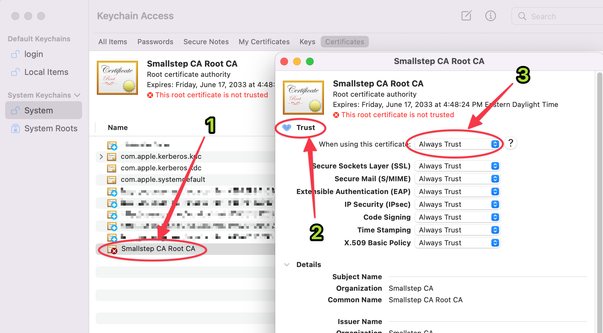
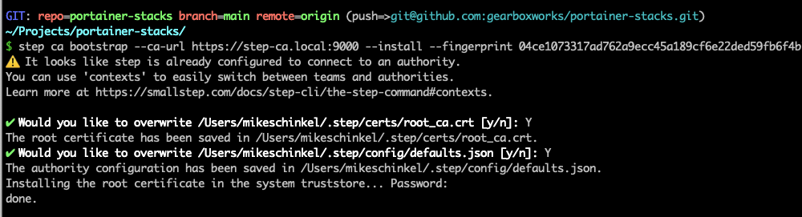
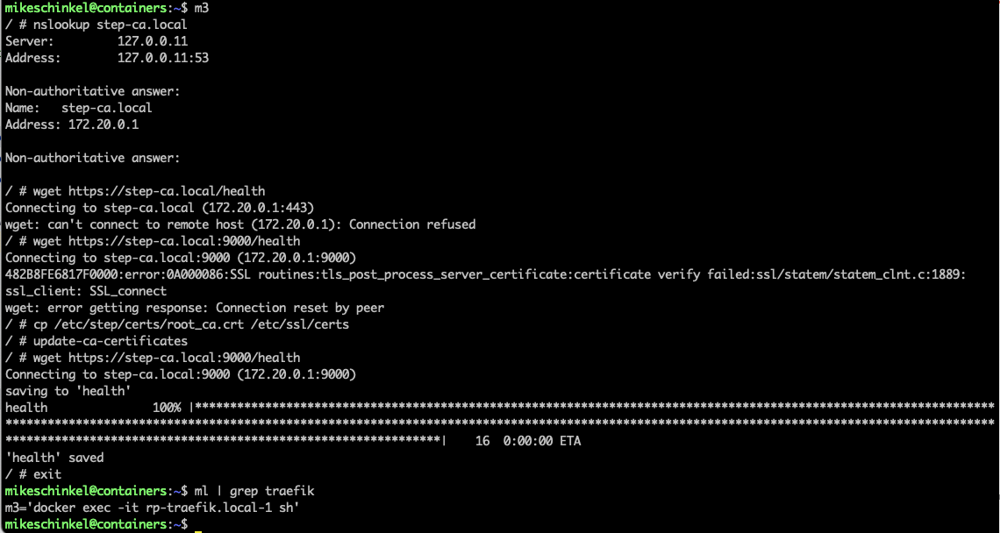

# portainer-stacks
Learning repo for an example Git-backed Portainer Implementation


## Setting up Smallstep's open-source Certificate Authority (`step-ca`) on Portainer and routing with Traefik as a Reserve Proxy for SSL certs on `.local` domains.

THESE ARE PRIMARILY JUST NOTES AND NEED TO BE FULLY TESTED.


1. This assumes Portainer is running on a VM 
   * in my case it was a Debian 11 VM on VMware ESXi v7.3
 
2. Set up the Portainer server:
   ```
   sudo su
   mkdir -p "/etc/traefik"
   
   mkdir -p "/etc/step"
   chown 777 "/etc/step"
   ```
3. Make sure your host is running the latest version of `docker-compose`. 
   * [How to upgrade docker-compose to latest version](https://stackoverflow.com/questions/49839028/how-to-upgrade-docker-compose-to-latest-version)

4. Create the `shared` network of type `bridge` 
   * For this I used `172.20.0.0/16` and  `172.20.0.11`; other configurations will probably work.
   * Note I am no networking expert.

5. In Portainer, create the `ca` stack _(Certificate Authority)_ for `step-ca` using `docker-compose.step-ca.yaml`
    1. Add `PASSWORD` environment variable and a good password in the `step-ca` Portainer stack:
       * I used `password` because this is just a proof-of-concept 
    2. Capture CA administrative username (`step`?), password (`password`?) and Root Fingerprint [from the Step CA container logs](https://youtu.be/COuqmqvCVEc?t=89) into a safe place such as your Password Manager.
   
6. Download file from https://step-ca.local:9000/roots.pem 
   * On macOS, open it and add to your "System" Keychain then open it and change trust to _"Always Trust":_
      
   * I did not try this on Linux or Windows.
     * Submit a pull request if you get it working for desktop use on either OS. 

7. Run `step ca bootstrap --ca-url https://step-ca.local:9000 --install --fingerprint <fingerprint>` on macOS to point to Step CA running on Debian 11 VM:
   

8. Download `roots.pem` and install on macOS using `step certificate install ~/Downloads/roots.pem`.

9. In Portainer, create the `rp` stack _(Reverse Proxy)_ for `traefik` using `docker-compose.traefik.yaml`.

10. In the `Traefik` container do this (CRITICAL!):
   ```
   cd /etc/step/certs
   cp root_ca.crt /etc/ssl/certs
   update-ca-certificates
 ```
In the following screenshot `m3` at the top is a [Bash Macro](https://github.com/mikeschinkel/bash-macros) which runs the command `docker exect -it rp-traefik.local-1 sh`. 

You can see what `m3` is defined to be at the bottom of the screenshot.


12. In the `Portainer` VM do this:
   ```
   sudo cp root_ca.crt /etc/ssl/certs
   sudo update-ca-certificates
  ```

See: [How to make Traefik trust our company CA for letsencrypt cert generation?](https://stackoverflow.com/questions/66154279/how-to-make-traefik-trust-our-company-ca-for-letsencrypt-cert-generation).


## Notes:
1. Google (or at least Bing) doesn't appear to index Traffic Community forums (verify this first)
2. Apparently the ACME request has to go through Traffic in order to work; i.e. you can't just use internal Docker DNS names (verify).


### Why `iputils-ping` vs. `inetutils`?
- https://unix.stackexchange.com/a/400354/144192